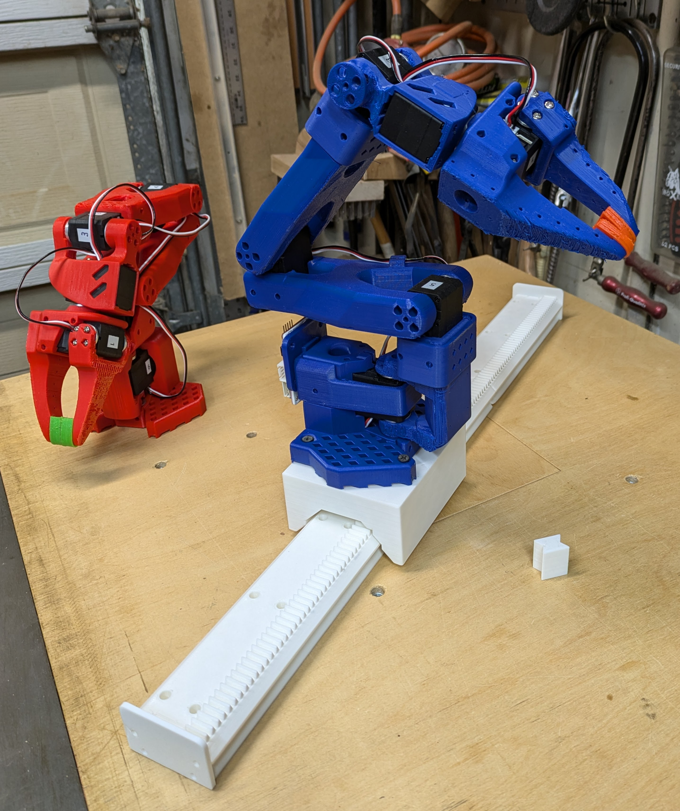
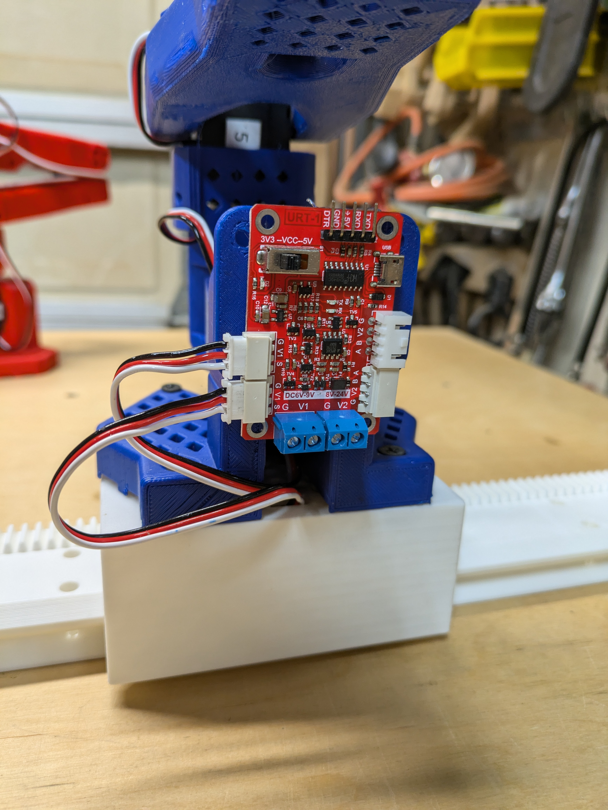
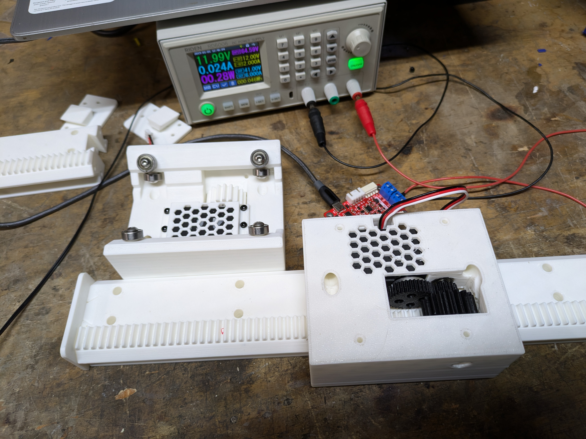
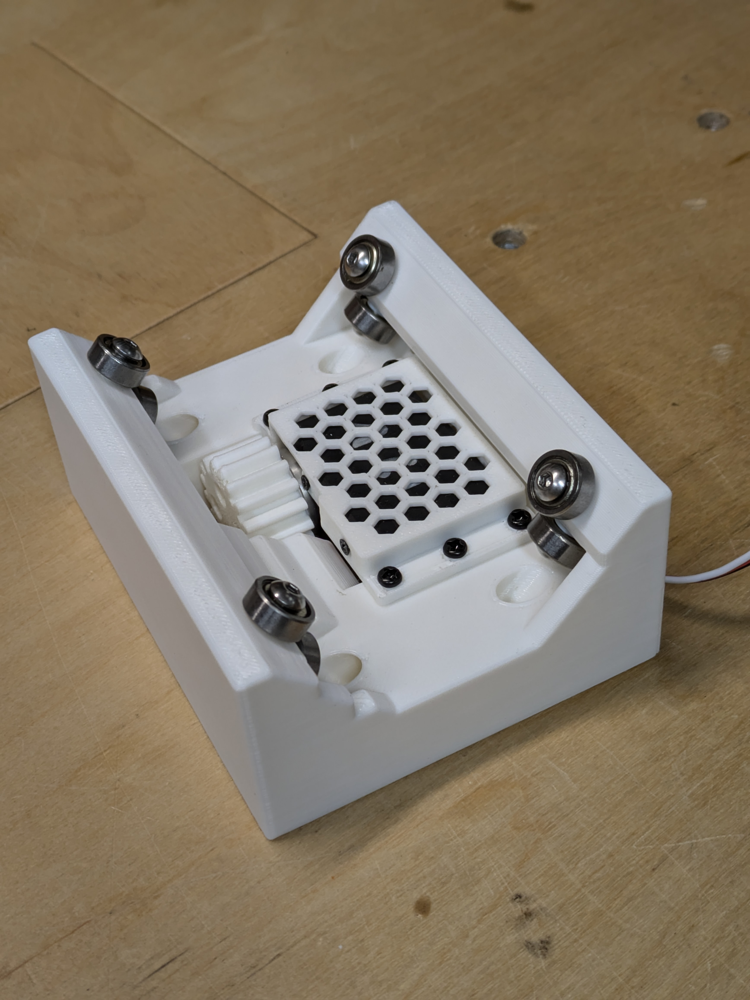
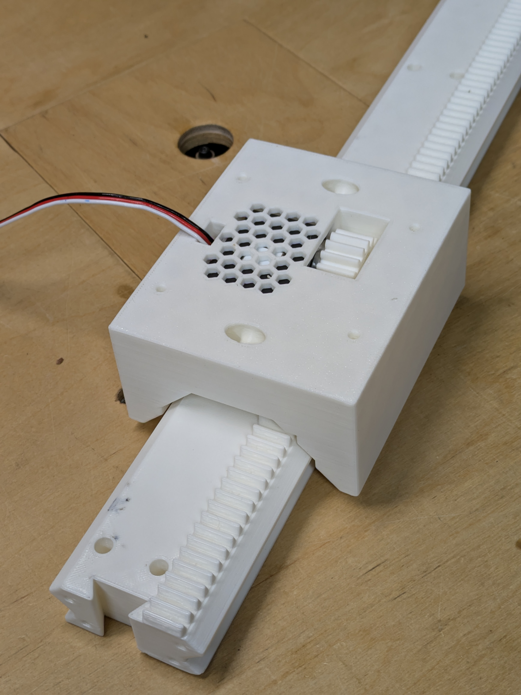
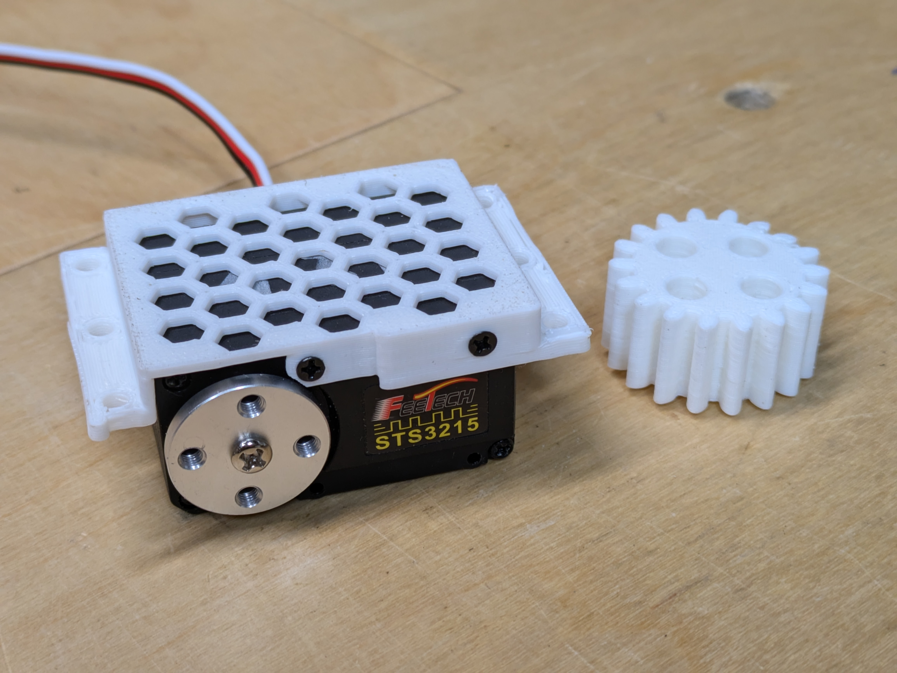

# 
SO-ARM100 Track Axis

## Summary
This project is related to the [SO-ARM100](https://github.com/TheRobotStudio/SO-ARM100) robot arm and [LeRobot](https://github.com/huggingface/lerobot)

It provides an additional axis, using the same STS3215 servo.

The carriage comes in 2 Versions:
1) Direct Drive (best for leader with [encoders](https://github.com/avenhaus/SO-ARM100-Encoders) or higher precision)
2) Additional gear for twice the speed

## Hardware

- 1 x FeeTech STS3215 Servo (same as SO-ARM100)
- 8 x 624 Bearing (ID: 4mm / OD: 13mm / H: 5mm)
- 8 x M4 10mm or 12mm machine screws for bearings
- 6 x M3 6mm or 8mm screws for motor bracket
- 4 x M4 20mm bolts and hex nuts to mount arm to slide (there are also versions with 3.2mm holes for drywall screws)
- M3 wood screws to mount rails to wooden base

The "Fast" version with additional gear additionally needs: 
- 2 x 624 Bearing (ID: 4mm / OD: 13mm / H: 5mm)
- 1 x 4mm rod, ca. 35mm, longer is fine

### Drive Gear Specs

- Modulo: 1.5
- Pressure Angle: 20
- 18 Teeth
- Height: 14mm 

## Code

The servo can give current feedback. This is used to home the axis and find the length of the track. A small python program demonstrates this and also shows how to keep track of multiple servo rotations.

- Find end of track
- Find home position
- Move to 10% and 90% of track length
- Move to middle

# Images

Video: https://youtu.be/PuqxYcexV3M

